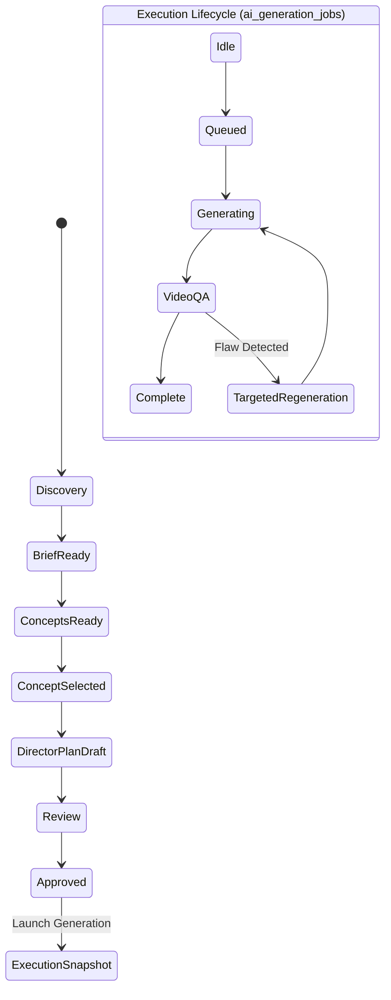

# AdSpec v1 & Director State Architecture

## Executive Overview

Writopedia is an **AI Advertising Director Platform**, not a "prompt generator".

The central architectural foundation is **AdSpec v1**, a strongly typed, versioned, provider-neutral specification representing the creative and commercial source of truth for an advertisement. Prompts, provider payloads, generation jobs, and video QA evaluations are derived, downstream execution artifacts.

---

## 1. What AdSpec Is

`AdSpec` is the canonical domain model representing an advertisement across its entire lifecycle.

Structurally, `AdSpec` encompasses:
```
AdSpec (v1.0.0)
├── identity          -> Stable adId, monotonic specVersion, creative/execution state
├── brief             -> Commercial intent (clean values: objective, audience, duration, CTA, tone)
├── decisionMetadata  -> Decision & Provenance Registry (source, confidence, status, locks)
├── creative          -> Alternative creative concepts & selected concept
├── brand             -> Integration with Brand Intelligence & deterministic rule priority
├── assets            -> Asset Bible (canonical Writopedia asset IDs with semantic roles)
├── characters        -> Character Bible (stable IDs, granular locks: identity, face, wardrobe...)
├── products          -> Product Bible (granular locks: geometry, logo, packaging, brandColors...)
├── locations         -> Location Bible (granular locks: architecture, spatial, lighting...)
├── story             -> High-level narrative structure & story beats
├── shots             -> Primary execution units (action choreography, camera, lighting, audio, QA)
├── continuity        -> Machine-readable continuity graph & state inheritance
├── constraints       -> System of must / should / must_not constraints
├── generationRequirements -> Provider-neutral generation requirements (frames, audio, references)
├── validationStatus  -> Validation status with freshness tracking (version, authoritative flag)
└── metadata          -> Author provenance and audit trail
```

---

## 2. Why AdSpec Is Canonical

In traditional prompt-centric video generators, the prompt is overloaded with commercial intent, cinematography instructions, character consistency hacks, and model-specific workarounds. This causes three fatal architectural flaws:
1. **Destructive Revisions**: Changing camera movement requires regenerating the whole prompt, risking loss of character wardrobe or brand rules.
2. **Model Lock-In**: Prompts hardcoded for one model syntax cannot be executed on another.
3. **No Measurable QA**: An evaluator cannot test whether a video succeeded without comparing it against structured expectations.

In Writopedia:
- **The AdSpec is the source of truth.**
- Prompts are compiled on-demand from the AdSpec for the specific target provider.
- AI Video QA compares generated video frames against the shot's declared `qaExpectations`.

---

## 3. Difference Between Brief, Concept, and Director Plan

| Layer | Domain | Question Answered | Example Content |
| :--- | :--- | :--- | :--- |
| **Commercial Brief** | Business Intent | *What are we selling, to whom, and why?* | Objective, target audience pain points, offer, CTA intent, duration, platform. |
| **Creative Concept** | Conceptual Territory | *What is the dramatic angle or metaphor?* | One-line premise, core idea, hook mechanism, emotional arc, novelty rationale. |
| **Director Plan (Shots)** | Visual Execution | *How does each camera frame and action move?* | Lens focal length, camera movement, contrast ratio, action choreography, audio cues. |

---

## 4. Creative State vs. Execution State

Creative planning and model execution possess separate lifecycles and state machines:



- **Creative States**: `discovery` → `brief_ready` → `concepts_ready` → `concept_selected` → `director_plan_draft` → `review` → `approved` → `execution_snapshot`.
- **Execution States**: `idle` → `queued` → `generating` → `qa` → `complete` → `failed`.

An approved AdSpec can exist before any generation is launched.

---

## 5. Clean Values & First-Class Decision Registry

Rather than wrapping every single primitive field in verbose `{ value, source, confidence, locked }` wrappers—which creates schema bloat and query friction—AdSpec v1 enforces:
1. **Clean Field Values**: Brief fields (`desiredDurationSeconds`, `cta`, `targetAudience`, etc.) store straightforward types (`number`, `string`, structured objects).
2. **Decision Registry**: A dedicated `decisionMetadata: Record<string, DecisionProvenance>` stores provenance:
   - `source`: `'user_provided' | 'ai_inferred' | 'system_derived' | 'brand_guideline'`
   - `status`: `'confirmed' | 'draft' | 'proposed'`
   - `confidence`: `0.0 - 1.0`
   - `locked`: `boolean`
   - `confirmedAt`, `confirmedBy`, and `reason`
3. **Approval Policy**: Mutations to user-confirmed fields require explicit approval, preventing AI drift while allowing clean programmatic consumption.

---

## 6. Granular Sub-Property Locks

Entity locks operate at sub-property granularity rather than all-or-nothing:
- **Character Locks**: `'identity' | 'face' | 'hair' | 'body' | 'wardrobe' | 'accessories' | 'voice'`
- **Product Locks**: `'geometry' | 'logo' | 'packaging' | 'brandColors' | 'label' | 'material'`
- **Location Locks**: `'architecture' | 'spatial' | 'lighting' | 'props' | 'atmosphere'`

If a user or brand guideline locks a character's `'wardrobe'`, the AI Director can safely suggest camera angles or emotional expressions, but any wardrobe change is flagged as `REQUIRES_CONFIRMATION` or rejected.

---

## 7. Versioning, Lineage & Validation Freshness

- Every AdSpec revision increments `identity.specVersion` as a strictly monotonic integer (`1`, `2`, `3`...).
- Revisions link back to their parent version through `identity.parentVersionId` (`${adId}_v${parentVersion}`).
- **Validation Freshness**: Validation responses are stamped with `evaluatedAtVersion`, `evaluatedAtRevisionId`, and `isAuthoritative: true`.
- When an AdSpec is patched, its validation status is automatically invalidated (`isAuthoritative: false`), ensuring that execution or review never proceeds on stale validation results.

---

## 8. Shot-Level Revision Invariance

When a user or AI director requests:
> *"Make shot 3 camera movement an orbital arc and increase contrast."*

The revision engine ([`packages/ad-director/adspec/revisionEngine.ts`](file:///c:/zz_ALL/z_Project/Writopedia/packages/ad-director/adspec/revisionEngine.ts)) applies a targeted `AdSpecPatch`:
```json
{
  "targetScope": "shot",
  "targetEntityId": "shot_03",
  "changes": {
    "camera.cameraMovement": "orbital_arc",
    "lighting.contrast": "high"
  }
}
```

**Invariant Guarantee**:
- Shot 1, Shot 2, Shot 4 remain 100% identical.
- Brief, Brand, Characters, Products, and Locations are completely untouched.
- A structured `AdSpecDelta` records modified paths, previous values, and new values.

---

## 9. Machine-Readable Continuity

Continuity is not a prompt instruction ("make it consistent"). It is a machine-readable data layer:
- Each shot declares:
  - `inheritedStates`: Explicit dependencies on preceding shots (`sourceShotId`, `entityId`, `aspect`, `requirement`).
  - `producedStates`: Output state description that subsequent shots can inherit.
- **Rule**: A shot can only inherit from preceding shots (`sourceShot.sequence < shot.sequence`). Forward dependencies and cycles are rejected by the validator.

---

## 10. Canonical Asset References

- Assets never duplicate binaries inside the AdSpec.
- The `AssetBible` references existing canonical `public.assets.id` UUIDs.
- References define semantic roles (`product_hero`, `character_face`, `first_frame`, `last_frame`, `style_reference`) with priority levels and usage constraints.
- Signed URLs are resolved on-demand at execution time via `VideoAssetResolver`.

---

## 11. Model Decoupling & Generation Requirements

AdSpec intentionally contains **no provider or model names** (e.g. no "runway", "kling", "luma"). Instead, it declares provider-neutral creative requirements:
- `requiresFirstFrame: boolean`
- `requiresLastFrame: boolean`
- `minimumReferenceCount: number`
- `requiresNativeAudio: boolean`
- `supportedAspectRatios: string[]`

Provider and model selection is strictly an **execution decision**, resolved at compile/launch time.

---

## 12. Execution Snapshot

Before launching an AI video job:
1. An immutable `ExecutionSnapshot` is created:
   ```ts
   {
     snapshotId: "snap_ad_123_v2_1726325000",
     adId: "ad_123",
     specVersion: 2,
     approvedAt: "...",
     approvedBy: "usr_01",
     frozenAdSpec: { ... }, // Deep-frozen copy of canonical AdSpec
     selectedProvider: "google-omni", // Execution decision
     selectedModel: "veo-3.1",        // Execution decision
     resolvedRequirements: { ... },
     resolvedAssetReferences: { ... },
     jobIds: ["job_abc_01"]
   }
   ```
2. The asynchronous generation job in `public.ai_generation_jobs` references `snapshotId`.
3. If the user subsequently edits the AdSpec (advancing to draft v3 or v4), the previous generation job remains permanently tied to the exact approved v2 state.

---

## 13. Legacy Video Request Compatibility

The legacy `VideoGenerationRequest` (`prompt`, `aspectRatio`, `durationSeconds`, `stylePreset`) seamlessly bridges to AdSpec v1 via `packages/ad-director/adspec/legacyAdapter.ts`:
- `fromLegacyVideoRequest()` maps legacy inputs to a valid `AdSpec v1` with clean brief fields, inferred shot 1, and explicit `decisionMetadata`.
- `toLegacyVideoRequest()` compiles an AdSpec shot back into a legacy generation payload for backwards compatibility.

---

## 12. Existing Writopedia Systems Reused

| Concern | Existing System Reused |
| :--- | :--- |
| **Identity & Access** | `public.workspaces` and `auth.users` with Row Level Security (`private.has_workspace_access`). |
| **Asset Management** | `public.assets.id` and `storageService.getSignedUrl`. |
| **Job Queue & Workers** | `public.ai_generation_jobs`, `aiJobRepository`, and `apps/worker/src/index.ts`. |
| **Credit Accounting** | `creditService.reserveCredits` (row-level holds) and `settleCredits`. |
| **Brand Intelligence** | `public.brand_guidelines` and `brandRepository.getDefaultGuidelines`. |
| **Engine Registry** | `apps/api/src/modules/videoGeneration/videoCapabilityRegistry.ts`. |
