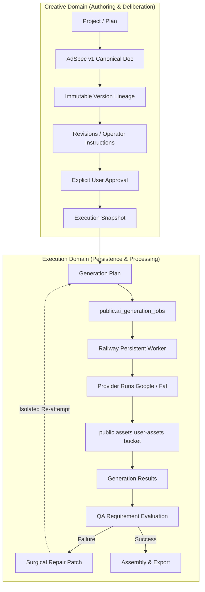

# AI Advertising Director: Database & Backend API Architecture

## 1. Architectural Foundation & Overview

Writopedia's **AI Advertising Director** bridges autonomous creative intelligence with high-fidelity production video generation. To deliver production-grade stability, the system enforces a strict separation of concerns between two distinct domains:

1. **Creative Domain**: Collaborative authoring, reasoning, versioning, and surgical revision of provider-neutral creative specifications.
2. **Execution Domain**: Frozen operational snapshots, model capability compatibility validation, prompt compilation, asynchronous worker dispatch via PostgreSQL, provider attempts, and requirement-grounded QA evaluation.

---

## 2. Existing Writopedia Entities Reused

Rather than creating duplicate infrastructure, the AI Advertising Director architecture extends Writopedia's existing production systems:

| Concept | Existing Canonical Entity | Architectural Integration |
| :--- | :--- | :--- |
| **Authentication & Users** | `auth.users`, `public.profiles`, `public.user_roles` | Authenticated via Supabase GoTrue; RBAC enforced through `user_roles`. |
| **Multi-Tenancy** | `public.workspaces`, `public.workspace_members` | Workspace boundaries strictly isolated via `private.has_workspace_access(workspace_id)`. |
| **Ad Project** | `public.ad_director_plans` | Root record tracking workspace tenancy, title, platform, aspect ratio, and version pointers. |
| **AdSpec Versions** | `public.ad_director_versions` | Immutable JSONB document snapshots preserving version lineage and deltas. |
| **Asset Library** | `public.assets`, Supabase `user-assets` storage bucket | Canonical storage path, SHA-256 checksums, and signed URL generation. |
| **Job Queue & Dispatch** | `public.ai_generation_jobs` | Reused directly; extended with `snapshot_id`, `shot_id`, `prompt_version_id`, `retry_count`. |
| **Worker Engine** | `apps/worker/src/index.ts`, `VideoJobWorker` | Standalone Railway background worker leasing jobs atomically with zero credit leakage. |
| **Financial Ledger & Credits**| `public.credit_balances`, `credit_holds`, `credit_ledger` | Drafting/approval costs 0 credits. Generation reserves atomic holds; worker captures upon asset upload. |

---

## 3. Database Schema Extensions (`20260908000001_ad_director_execution_architecture.sql`)

### Hybrid Relational + JSONB Model

- **Relational Columns**: Identity, workspace ownership, status enums, foreign keys, version numbers, attempt counters, and timestamps.
- **JSONB Documents**: Evolving creative specs (`plan_document`), patch deltas (`patch_delta`), revision operations, structured impact sets, model parameters, and QA requirement issues.

### Tables Summary

1. **`public.ad_director_versions` (Extended)**:
   - `parent_version_id UUID`: Parent version foreign key forming an immutable DAG lineage.
   - `schema_version TEXT`: Fixed at `'adspec_v1'`.
   - `content_hash TEXT`: SHA-256 fingerprint of canonical creative state.
   - `approved_at TIMESTAMPTZ`, `approved_by UUID`: Formal approval provenance.
2. **`public.ad_director_revisions` (New)**:
   - Captures user instructions, actor provenance, patch instructions, and direct/indirect/unaffected impact sets.
3. **`public.ad_director_execution_snapshots` (New)**:
   - Freezes approved AdSpec versions for execution. Live drafts cannot mutate a running snapshot.
4. **`public.ad_director_prompt_versions` (New)**:
   - Stores derived prompt artifacts per shot and model engine, including compiled prompt, negative prompt, and parameters.
5. **`public.ai_generation_jobs` (Extended)**:
   - Added `snapshot_id`, `shot_id`, `prompt_version_id`, and `retry_count`.
6. **`public.ad_director_provider_runs` (New)**:
   - Decouples the logical job from provider attempts/retries with sanitized request/response telemetry.
7. **`public.ad_director_generation_results` (New)**:
   - Tracks shot-level video outputs, attempt numbers, duration, and acceptance status.
8. **`public.ad_director_qa_results` (New)**:
   - Grounded QA records containing requirement-level evaluation (expected vs. observed) and surgical repair recommendations.

---

## 4. Architectural Invariants Verified

1. **Creative Truth**: AdSpec is the canonical creative document; model prompts are purely derived artifacts.
2. **Immutability**: Approved AdSpec versions are immutable. New versions produce new rows with parent lineage.
3. **Snapshot Isolation**: When AdSpec v2 is approved and frozen as Snapshot E1, drafting v3 does NOT alter E1 or its running jobs.
4. **Model Independence**: Switching target engines (e.g. Veo Pro to Google Omni) evaluates compatibility without altering creative truth.
5. **Surgical Repair**: QA failure on Shot 3 generates a patch affecting only Shot 3; unaffected shots, characters, and products remain 100% untouched.
6. **Zero Duplicate Infrastructure**: Zero parallel job queues, zero duplicate asset tables, zero separate billing engines.
7. **Zero Client Secrets**: Client never receives service role keys or provider API secrets; provider telemetry is sanitized before persistence.
8. **Multi-Tenant Security**: RLS strictly prevents cross-tenant access to plans, versions, snapshots, and results.

---

## 5. API Endpoints Reference

Mounted at `/api/ad-director`:

- `POST /adspec`: Create new canonical AdSpec project.
- `GET /adspec/:adId`: Retrieve current version of AdSpec.
- `GET /adspec/:adId/versions/:specVersion`: Retrieve specific immutable version.
- `POST /adspec/:adId/revise`: Apply patch revision with impact calculation.
- `POST /adspec/:adId/approve`: Formally approve AdSpec version.
- `POST /adspec/:adId/snapshot`: Create immutable ExecutionSnapshot from approved version.
- `GET /models/available`: List registered models and physical capabilities.
- `POST /models/validate`: Check model compatibility against an AdSpec.
- `POST /adspec/:adId/generation-plan`: Create generation plan, hold credits, and dispatch jobs.
- `GET /adspec/:adId/snapshots/:snapshotId`: Retrieve frozen snapshot details.
- `GET /adspec/:adId/snapshots/:snapshotId/prompts`: Retrieve compiled prompt versions.
- `GET /adspec/:adId/snapshots/:snapshotId/results`: Retrieve generation results.
- `GET /adspec/:adId/snapshots/:snapshotId/qa`: Retrieve QA requirement evaluations.
- `POST /adspec/:adId/snapshots/:snapshotId/qa`: Record QA evaluation with automated repair recommendation.
- `POST /adspec/:adId/snapshots/:snapshotId/shots/:shotId/regenerate`: Regenerate single shot attempt.
- `GET /adspec/:adId/revisions`: Inspect revision audit history.
- `POST /adspec/:adId/export`: Compile approved shot results into final export assembly.
