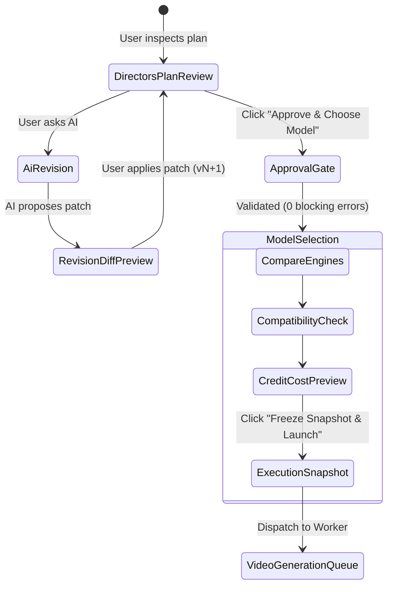

# AI Advertising Director: Director's Plan UX Architecture

## 1. Product Positioning

Writopedia is an **AI Advertising Director Platform**, not a generic AI video prompt generator.

The **Director's Plan** is the central, interactive production document of the platform. It replaces traditional "prompt boxes" and form-fill interfaces with a professional commercial production workspace:
- **For Marketers**: Immediately reveals what the advertisement is selling, the dramatic concept, hook mechanism, narrative progression, and call to action.
- **For Creators / Directors**: Provides granular cinematographic control over lens focal lengths, camera movement trajectories, volumetric lighting, temporal action choreography, multi-shot continuity, and acceptance criteria.
- **For Production Safety**: Clearly surfaces machine-readable preserved locks (character appearance/wardrobe, product packaging/logo, location lighting) and guarantees that AI revisions are surgical rather than destructive.

---

## 2. Information Hierarchy

The screen follows a clear, top-down visual hierarchy designed for rapid scannability:

```
┌────────────────────────────────────────────────────────────────────────────────────────┐
│ 1. TOP HEADER                                                                          │
│    Ad Title · Duration (18.0s) · Aspect Ratio (9:16) · Platform (Reels) · Status ·     │
│    Production Bibles Button · Version History (v2) · [Approve & Choose Model]          │
├────────────────────────────────────────────────────────────────────────────────────────┤
│ 2. COMMERCIAL CREATIVE SUMMARY                                                         │
│    Selected Concept ("Every Morning Ritual") · Creative Mechanism (Kinetic Action) ·  │
│    Curiosity Hook (First 2.5s) · Emotional Arc · Key Message · CTA (Text & Intent) ·   │
│    Decision Provenance & Confirmed Decision Badges                                     │
├────────────────────────────────────────────────────────────────────────────────────────┤
│ 3. PRODUCTION SHOT TIMELINE                                                            │
│    00:00.0s ──── Shot 01 (3.5s) ──── Shot 02 (3.5s) ──── Shot 03 (4.0s) ──── 18.0s    │
│    Clickable duration-proportional segments with timecode markers & purpose labels     │
├────────────────────────────────────────────────────────────────────────────────────────┤
│ 4. SCANNABLE SHOT CARDS (Heart of the Workspace)                                       │
│    • Shot Sequence & Time Range (06.0s – 09.5s) · Purpose Badge (Product Reveal)       │
│    • Human-Language Visual Action Summary                                              │
│    • Cinematography: Framing · Angle · Movement · Lens · Depth                         │
│    • Environment & Volumetric Lighting Mood                                            │
│    • Featured Subjects with Preserved Lock Indicators (Alex ✓, Hydra Bottle ✓)         │
│    • Audio Design (Voiceover, Foley SFX, Music Dynamics)                               │
│    • Continuity Link ("Continues from Shot 02") / Conflict Alerts                     │
│    • Reference Asset Thumbnails with Semantic Role Badges                              │
│    • Quick Actions: Inspect Detail · Ask AI about Shot                                │
├────────────────────────────────────────────────────────────────────────────────────────┤
│ 5. AI CREATIVE DIRECTOR REVISION ENTRY ("Ask AI Director...")                         │
│    Context-Aware Target Indicator: [Shot 03] vs [Entire Ad] · Quick Suggestion Chips · │
│    Natural Language Input · Structured Diff Preview Trigger                            │
├────────────────────────────────────────────────────────────────────────────────────────┤
│ 6. ADVANCED TECHNICAL PROMPT VIEW (Collapsible & Non-Authoritative)                   │
│    Transparent Compiled Model Prompt · Clear Boundary Notice: Plan is Canonical        │
└────────────────────────────────────────────────────────────────────────────────────────┘
```

---

## 3. Human Language First: Cinematographic Translation

AdSpec v1 maintains strict, machine-readable domain types internally, but the interface translates all fields into natural creative language:

| Structured Data Value | Human-Language UI Output |
| :--- | :--- |
| `camera.cameraMovement = "orbital_arc"` | **Camera:** Orbital Cinematic Arc |
| `camera.framing = "extreme_close_up"` | **Framing:** Extreme Close-Up |
| `camera.angle = "low_angle"` | **Angle:** Low Hero Angle |
| `camera.depthOfField = "shallow"` | **Depth:** Shallow Cinematic Depth of Field |
| `lighting.contrast = "high"` | **Lighting:** High Contrast Studio Rim |
| `action.choreography[0].relativeStart = 0.0` | **Opening Beat (0.0s – 1.5s):** Droplet beads on matte surface |
| `continuity.trackers[0]` | **Continuity:** Continues from Shot 02 (Preserves wardrobe) |
| `qaExpectations.subjectProminence = "hero_focus"` | **Prominence:** Hero Focus (Foreground Center) |

---

## 4. Progressive Disclosure: Shot Detail View

The workspace avoids cognitive overload by using a high-information scannable card on the primary canvas, while providing a deep cinematographic drawer for users who want complete technical precision:

1. **Top Level (Card)**: Visual description, camera movement, location, subjects, audio cues, continuity link, references.
2. **Deep Level (Drawer)**:
   - Temporal Action Choreography breakdown (`0.0s - 1.5s`, `1.5s - 3.5s`) with body mechanics and object interactions.
   - Cinematographic lens characteristics, focal length, depth of field, and compositional framing.
   - Lighting source, time of day, contrast ratio, and volumetric atmosphere.
   - Audio script dialogue, sound effects cues, and score dynamics.
   - Preserved locks and subject consistency constraints.
   - Video QA Acceptance Criteria (`Must show`, `Must not show`, text legibility).

---

## 5. Decision Provenance & Preserved Locks

The UI visualizes the underlying decision provenance registry (`decisionMetadata`):
- **Confirmed by User**: Highlighted with green checkmark badges (e.g. `✓ Confirmed Concept`, `✓ Confirmed Duration`). Any AI proposal attempting to mutate confirmed fields triggers an explicit confirmation requirement.
- **Preserved Locks**: Subtle badges on character, product, and location cards (e.g. `✓ Identity locked`, `✓ Wardrobe locked`, `✓ Packaging locked`). Answers the crucial creator question: *"What will AI preserve when I revise this shot?"*

---

## 6. Surgical Revision Engine & Diff Preview

When a user instructs the AI Director (e.g. *"Make Shot 3 camera an orbital arc and increase contrast"*):
1. The AI Director proposes structured mutations rather than replacing the whole document.
2. **Before applying**, the `RevisionDiffModal` renders a structured preview derived from `AdSpecDiff`:
   - **Modified Fields**: Before vs After highlighted side-by-side.
   - **Unaffected Elements**: Proves that Shots 1, 2, 4, 5, Characters, Product, and Brand Rules remain 100% untouched.
   - **Change Impact**: Directly affected vs indirectly affected components.
3. The user clicks **Apply Revision to Plan** to atomically increment the AdSpec version (e.g. v1 → v2).

---

## 7. Approval & Model Selection Boundary

The Director's Plan maintains a strict separation between **Creative Approval** and **Execution Spending**:



- Opening or editing the Director's Plan **never generates a video** or burns credits.
- The button is labeled **`[Approve & Choose Model]`** (never "Generate").
- The user consciously reviews model capabilities against plan requirements (references count, duration, native audio) before authorizing generation credits.
